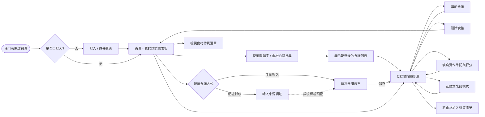
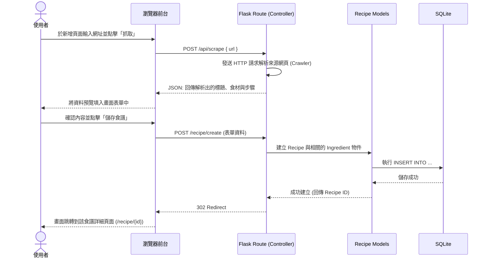

# 食譜收藏夾 流程圖與路由設計 (FLOWCHART)

這份文件根據 PRD 需求與 ARCHITECTURE 系統架構，描述了系統中的使用者操作路徑、資料流的系統序列圖。

## 1. 使用者流程圖（User Flow）

此流程圖描述使用者進入網站後的各種操作路徑，涵蓋食譜的管理、抓取、互動操作等：

## 2. 系統序列圖（Sequence Diagram）

以下呈現「使用者透過一鍵網頁抓取，預覽後存入個人食譜」的完整資料流與系統互動：

## 3. 功能清單對照表 (Route Map)

依據流程圖中的行為，規劃出對應的 URL 路徑與 HTTP 方法表，供後端實作路由與模版渲染參考：

| 模組 (Blueprint) | 功能名稱 | URL 路徑 | HTTP 方法 | 備註 |
| --- | --- | --- | --- | --- |
| **Auth** | 註冊帳號 | `/register` | GET / POST | 渲染註冊表單或處理註冊邏輯 |
| **Auth** | 使用者登入 | `/login` | GET / POST | 渲染登入表單或驗證帳戶密碼 |
| **Auth** | 使用者登出 | `/logout` | GET | 清除 Session |
| **Recipe** | 食譜儀表板 (首頁) | `/` 或 `/dashboard` | GET | 列出該使用者的食譜、可輸入搜尋與篩選 |
| **Recipe** | 檢視食譜詳細 | `/recipe/<id>` | GET | 以 Jinja2 渲染食譜內容與標籤 |
| **Recipe** | 互動式烹飪模式 | `/recipe/<id>/cook` | GET | 大字體預覽畫面，切換步驟 |
| **Recipe** | 建立新食譜 | `/recipe/create` | GET / POST | 提供表單 (GET) 及儲存入資料庫 (POST) |
| **Recipe** | 更新筆記與評分 | `/recipe/<id>/note` | POST | 局部更新實作筆記與自我評分 |
| **Recipe** | 編輯食譜 | `/recipe/<id>/edit` | GET / POST | 讀取舊資料帶入表單 (GET) 及更新操作 (POST) |
| **Recipe** | 刪除食譜 | `/recipe/<id>/delete` | POST | 安全考量，僅限 POST 操作刪除 |
| **Crawler** | 一鍵網頁抓取 API | `/api/scrape` | POST | 非同步 (AJAX) 呼叫，回傳 JSON 提供給前端填表 |
| **Recipe** | 增修待買食材清單 | `/grocery-list` | GET / POST | 檢視總待買清單 (GET)、勾選或增刪食材 (POST) |
| **Admin** | 管理員後台總覽 | `/admin/dashboard` | GET | (MVP 進階) 可看見所有用戶與違規食譜 |
